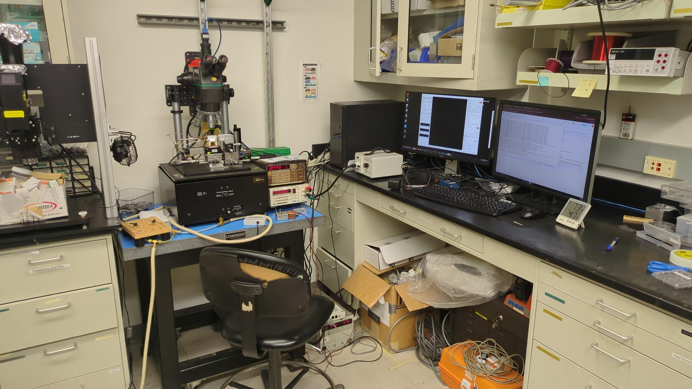

# Air Stacker PC — Reference

Workstation that drives the **Air Stacker** (the simpler in-use stacker, **not** Ranger).

Wide view of the bench — microscope + stamp stage on the isolation table (left), the Omega temp controller on the blue mat (center), and the PC running `air-stacker-gui` (camera feed on the left monitor, log on the right):

## Connectivity

- **Tailscale**: `air-stacker.tail737ca5.ts.net` (100.92.166.118), Windows, owned by `dgglab@`. *(Rename in the admin panel may still be pending — local hostname pref is set; if DNS still resolves only `stacker.tail737ca5.ts.net`, force-rename via https://login.tailscale.com/admin/machines.)*
- **SSH**: `ssh air-stacker` (alias defined in `~/.ssh/config`). User is `ddg_transfer` — note the typo'd username, two d's at the start. Key auth via `administrators_authorized_keys` (admin user).
- **RustDesk**: service running. Entry on the wiki: [RustDesk Addresses](https://wiki.sharpelab.science/doc/rustdesk-addresses-y3aYDSeXCw) ("Air Stacker" section).
- **VNC**: vncserver service also running.
- **Default SSH shell**: Git Bash (`C:\Program Files\Git\usr\bin\bash.exe`).

## Camera

- **Hardware**: **Flea3 FL3-U3-20E4C** (USB3, **2.0 MP** color Bayer, **1600×1200** native, ~59.5 fps cap). Sole connected camera. Camera node map still reports `DeviceVendorName = "Point Grey Research"` even though FLIR / Teledyne now own the line.
- **Pixel format**: default `BayerBG8`. Camera also exposes `BayerBG12p` / `BayerBG12Packed` / `BayerBG16` (higher bit depth), `Mono8` / `Mono12*` / `Mono16` (grayscale), `RGB8` (on-camera debayer), and several `YCbCr*` variants. Custom GUI uses `BayerBG8` and debayers host-side via OpenCV.
- **Binning**: 2×2 only. Set via `BinningVertical = 2` — the "vertical" name is misleading; on this Flea3 the horizontal node is read-only and slaves to the vertical, so writing 2 to `BinningVertical` gives 2×2 binning (1600×1200 → 800×600). No mode toggle (`BinningVerticalMode` is missing — camera does whatever it does, presumably averaging like-colored Bayer pixels). No 4× option, no decimation. Frame-rate cap stays at 59.47 Hz at both binning settings (sensor-readout-bound, not bandwidth-bound). Probe lives at [`air-stacker-gui/probe_binning.py`](../air-stacker-gui/probe_binning.py).
- **SDK**: FLIR / Teledyne Spinnaker **4.3** (rebranded from "FLIR Systems" → "Teledyne" in the 4.x install path: `C:\Program Files\Teledyne\Spinnaker\`).
- **PySpin**: vendored as a wheel under `air-stacker-gui/vendor/spinnaker_python-4.3.0.190-cp310-cp310-win_amd64.whl`, registered via `[tool.uv.sources]` in `pyproject.toml`. Pinned to Python 3.10 + numpy<2 (Spinnaker 4.3 ships only cp310 wheels and was built against the NumPy 1.x ABI).
- **GenTL producer**: `.cti` files at `C:\Program Files\Teledyne\Spinnaker\cti64\vs2015\` (the `GENICAM_GENTL64_PATH` env var points there). Our GUI uses PySpin directly and doesn't need GenTL — only consumers like `harvesters` (no longer used in our GUI) or SpinView do.
- **Diagnostic GUIs**: `SpinView` at `bin64\vs2015\SpinView.exe` (replaces the old `SpinView_WPF.exe`). Useful for live exposure / WB / gamma sliders without launching our app.
- **Legacy / unused** Desktop shortcuts (ignore): FlyCap2 (`Camera.lnk`), IC Capture 2.5, Micro-Manager / ImageJ (`hist but slower fps.lnk`).

## Secondary camera

- **Hardware**: **Anker PowerConf C200** USB-C UVC webcam. Used as a contextual view of the stage + front-panel instruments alongside the through-objective FLIR feed. Display-only — not part of the science data path.
- **USB enumeration**: `VID_291A`, `PID_3369`, single video interface (`MI_00`). PnP `FriendlyName = "Anker PowerConf C200"`. Enumerates under `Get-PnpDevice -Class Camera`.
- **Native resolutions & framerates** (probed 2026-05-10 via `QMediaDevices.videoInputs()`):

  | Resolution | NV12 / MJPEG | YUYV   |
  |------------|--------------|--------|
  | 2560×1440  | 30 fps       | —      |
  | 1920×1080  | 30 fps       | —      |
  | 1280×720   | 30 fps       | —      |
  |  640×480   | 30 fps       | 30 fps |
  |  640×360   | 30 fps       | 30 fps |
  |  320×240   | 30 fps       | 30 fps |

  `cv2.VideoCapture` + DSHOW forces YUYV and caps at ~18 fps above 1080p. Qt Multimedia / Media Foundation negotiates NV12 or MJPEG and sustains 30 fps at every supported resolution. GUI default: **1280×720 NV12 @ 30 fps**.

- **GUI integration**: opens via `PySide6.QtMultimedia` (`QCamera` + `QMediaCaptureSession` + `QVideoWidget`). Toggle lives on the bottom `StatusBar` of [`air-stacker-gui/main.py`](../air-stacker-gui/main.py); closed by default. Window class: [`webcam_window.py`](../air-stacker-gui/webcam_window.py). Config-parsing + device/format picking: [`webcam.py`](../air-stacker-gui/webcam.py). Design rationale: [`WEBCAM_PIP_PROPOSAL.md`](../air-stacker-gui/WEBCAM_PIP_PROPOSAL.md).

- **Standard UVC controls accessible** (typed in Qt Multimedia where noted): brightness, contrast, saturation, sharpness, gamma, hue, focus + autofocus (`QCamera.setFocusMode` / `setFocusDistance`), exposure + auto (`setExposureMode` / `setManualExposureTime`), white balance + auto (`setWhiteBalanceMode` / `setColorTemperature`), digital zoom (`setZoomFactor`), digital pan/tilt. Gain, backlight, iris, roll are not exposed on this model. AI tracking, HDR, anti-flicker, FoV preset are vendor UVC extension units (XU) — configurable only via the Anker Work utility, not via standard APIs. None of those vendor features are useful for our static-frame monitoring use case; already configured on the box and the GUI doesn't touch them.

- **DirectShow filter conflict**: index 1 under `cv2.CAP_DSHOW` enumerates the Spinnaker DirectShow filter for the FLIR Flea3 (Spinnaker installs one). Don't open by numeric index — pin by `QCameraDevice.id()` or by description substring match. Our GUI does the latter.

- **Probe scripts**: [`probe_webcam.py`](../air-stacker-gui/probe_webcam.py) (cv2 / DSHOW resolution × fps grid), [`probe_webcam_controls.py`](../air-stacker-gui/probe_webcam_controls.py) (cv2 CAP_PROP_* + Qt Multimedia format enumeration). Both read-only and safe to re-run.

## Stage — CONEX-CC

- **Hardware**: Newport CONEX-CC dual-axis: **Z and spin** (not X+Z). Two USB-serial controllers.
- **Ports**: COM3 + COM4 (USB Serial Port). Firmware/driver string: `CONEX-CC 2.0.1`.
- **Existing front-ends on the box**:
  - Vendor GUI: `C:\Newport\Motion Control\CONEX-CC\Bin\64-bit\Newport.CONEXCC.StandAlone.exe` (Desktop: `Stage Controller.lnk`).
  - LabVIEW custom UI: `~/Desktop/CONEX-CC-GUI/` — git remote `https://github.com/caoyuan96421/CONEX-CC-GUI.git`. Likely the day-to-day tool. `.lvproj`/`.lvlps` LabVIEW project. Uses NI-VISA (NI MAX is installed).
- **Protocol**: ASCII serial (Newport CONEX-CC documented protocol). Easy to drive directly without LabVIEW.

## Z stage — SMC100CC (added 2026-05-08)

- **Hardware**: Newport **SMC100CC** (DC servo variant of the SMC100 Series Motion Controller / Driver), single-axis. Daisy-chain capable but the lab uses a single unit currently. Variant identified from `1VE?` reply (`SMC_CC`); the PP variant would identify as `SMC_PP`.
- **Firmware**: Controller-driver version **3.1.2**.
- **Stage**: Newport **LTA-HS** "high-speed" linear translation actuator (DC servo + rotary encoder, ESP-compatible — the SMC100 reads `ZX=3` and pulls config straight from the stage's smart-memory chip on connect). Reported via `1ID?` as `LTA-HS_PN:B0601246985103_UD:062509`. ESP-loaded soft limits **−0.1 mm to +50.1 mm** (`1SL`/`1SR`); encoder unit **3.539 × 10⁻⁵ mm ≈ 35.4 nm/count** (`1SU`). Default velocity 5 mm/s (`1VA`), acceleration 20 mm/s² (`1AC`), homing velocity 2.5 mm/s (`1OH`), home-search type 4 (`1HT`). The LTA-HS shaft engages the microscope's focus-axis drive — photo: [`img/smc100-focus-drive-shaft.jpeg`](img/smc100-focus-drive-shaft.jpeg).
- **Safe operating envelope**:
  - **Positive cap: 30 mm (operational limit)** — must not exceed on this rig regardless of what the ESP-loaded `SR` says. Enforced in software only: the SMC100 driver/panel takes a `position_limits=` kwarg and the air-stacker caller passes an upper bound of **30.0 mm**. **Do not push this cap to the controller persistently** (i.e. CONFIG-mode `1SR30` → `PW0`) without explicit per-action authorization — see global rule against persistent writes to lab controllers.
- **Connectors** (front face, photo: [`img/smc100.jpeg`](img/smc100.jpeg)): KEYPAD, **RS232C** (DB9), RS485 IN, RS485 OUT, CONFIG. Top face: MOTOR, GPIO, DC OUT, +48V power input.
- **PC link**: RS-232C → USB-RS232 adapter (FTDI VID_0403+PID_6001, unit `FTE75V52A`) → enumerates as **COM5**. Confirmed reachable on 2026-05-08; `1VE?` returns `1VE SMC_CC - Controller-driver version  3. 1. 2`.
- **Protocol**: ASCII over 57600 8N1; addressed commands prefixed with controller index (`1` for first/master), terminated CRLF. `1VE?` = firmware version, `1ID?` = stage ID, `1TS` = state, `1TP` = position, `1RS` = reset. Full command set in the [Command Interface Manual](../air-stacker-gui/manuals/newport-smc100-command-interface.pdf).
- **State machine** (printed on the box): `CONFIG` ↔ `AUTO CONFIG` → `NOT REFERENCED` → `HOMING` → `READY` ↔ `MOVING` / `JOGGING` / `DISABLE`. Faults: `ERROR FE`, `MM0/MM1 ERROR FE`, `HARDWARE FAULT`. Detailed in §5 (Programming) of the [User's Manual](../air-stacker-gui/manuals/newport-smc100-user-manual.pdf).
- **DIP switches** on the back select RS-232 master vs. RS-485 slave; first controller in the chain must be in RS-232 master mode for PC comms.
- **Compensation** (probed 2026-05-09, see [`probe_smc100_config.py`](../air-stacker-gui/probe_smc100_config.py)):
  - **`BA` (backlash) = 0 mm** — disabled.
  - **`BH` (hysteresis) = 0 mm** — disabled.
  - Both configurable via the `BA` / `BH` ASCII commands, but only in CONFIGURATION state (`PW1` to enter) and only persisted with `PW0` (flash write, ~10 s). Per the global rule against persistent controller writes, changing these requires explicit per-action authorization.
- **Probe scripts**:
  - [`air-stacker-gui/probe_smc100.py`](../air-stacker-gui/probe_smc100.py) — sends `1VE?` and reports whether the controller replies. Useful for cabling iteration.
  - [`air-stacker-gui/probe_smc100_config.py`](../air-stacker-gui/probe_smc100_config.py) — read-only dump of firmware, stage ID, state, position, soft limits, encoder unit, motion params, BA/BH compensation, FE limit, and JM (keypad enable).
- **Cabling**: Newport's stock PC cable is wired DCE-style on the SMC100 end; a generic DB9 + USB-RS232 dongle (both DTE) needs a **null-modem adapter** to swap TX/RX. Current setup includes the null-modem and is working.
- **Manuals**: [User's Manual](../air-stacker-gui/manuals/newport-smc100-user-manual.pdf) (EDH0206En2060, 02/25 — install, wiring, state machine, ESP stage configuration), [Command Interface Manual](../air-stacker-gui/manuals/newport-smc100-command-interface.pdf) (EDH0311En1023, 12/21 — `Newport.SMC100.CommandInterface.dll` reference, but the ASCII command names match what goes over RS-232).
- **Known good positions**:
  - **Focus: ~27.691 mm** — recorded 2026-05-09 with the current sample stack. Use as a fall-back if focus is lost.

## Heater

- **Hardware**: **Omega Engineering Platinum** series controller. Device ID `062BE937`, firmware `1.4.0.6`, run mode RUNNING (per the Configurator's Device Information panel).
- **Connection**: USB-CDC virtual COM via Omega's `OmegaVCP.inf` driver — currently enumerated as **COM7**.
- **Protocol**: Modbus RTU at 19200 8N1, slave ID 1 by default. 32-bit IEEE floats span two consecutive holding registers. Manuals in [`air-stacker-gui/manuals/`](../air-stacker-gui/manuals/): [M5458 Modbus interface](../air-stacker-gui/manuals/omega-platinum-m5458-modbus.pdf) (register map + enums) and [M5451 controller user guide](../air-stacker-gui/manuals/omega-platinum-m5451-user-manual.pdf) (front-panel menus, OPER modes including M.CNt manual output / M.INP manual input).
- **Software**: `~/Desktop/Platinum_Firmware_Software_1.4.0.6/` containing `EIP_1.1.5`, `Firmware_1.4.0.6`, `Platinum_Configurator_1.5.2.0`, `USBDriver`. Launcher on Desktop is `Temp Controller.appref-ms` (ClickOnce).
- The earlier "Thermo Scientific Platinum" label in this doc was wrong — it's Omega.

## USB topology and additions policy

- **Intel xHCI root hub (motherboard ports)**: all four instruments — the three FTDI USB-serial adapters (COM3 / COM4 / COM5), the Omega heater VCP (COM7), and the FLIR Flea3.
- **Renesas add-in USB3 card (PCIe)**: the Anker PowerConf C200 webcam only. Anything transient that must be plugged in goes here, never on the Intel hub next to the instruments.
- **Aaron's rule: nothing else gets added to this PC** — no hardware on the USB bus, no software — without his OK. Third-party USB3 devices (bulk-streaming cameras in particular) have caused simultaneous serial timeouts on both FTDI adapters and are the main thing this rule guards against.
- **Stanford IT endpoint agents present**: CrowdStrike Falcon sensor + Device Control (a USB device-class policy engine) and the BigFix client. Not ours to touch; if USB devices start being blocked or re-enumerated unexpectedly, Device Control policy is a suspect.

## Defunct / disabled

- The USBTMC SCPI temp/humidity instrument that `~/something.py` used to poll (`SENS1:TEMP:DATA?` / `SENS2:HUM:DATA?` → `spxtr.net/demgraphs/` as `stacker.temp`/`stacker.hum`) is **no longer connected** — pyvisa enumerates no USB instruments. The script and its `something.bat` companion are still on disk but inert.
- Scheduled task **`Wowza`** that re-launched `something.py` at login has been disabled (not deleted) on 2026-05-05.
- **Fine-Z piezo (Yokogawa 7651 → Newport NPM140, Keithley 617 readback over GPIB)**: off the rig. Driving the NPM140 directly from the 7651 with no amplifier and a GPIB bus that wedged under polling never worked reliably; the fix is hardware, not software. The drivers, panel, probes, and manuals were removed from `air-stacker-gui` in September 2026 and live in git history. If the piezo returns it will be on different hardware and get a new driver. The NPM140's −20 V hard floor still applies to whatever drives it.

## Serial port map (current snapshot)

| Port | Device | Purpose |
|------|--------|---------|
| COM1 | Communications Port (legacy) | Unused |
| COM3 | USB Serial Port (FTDI) | CONEX-CC axis A — currently disconnected |
| COM4 | USB Serial Port (FTDI) | CONEX-CC Rotation Stage |
| COM5 | USB Serial Port (FTDI) | Newport SMC100 motion controller (RS-232C) |
| COM7 | USB Serial Device (Omega VCP) | Heater (Omega Platinum, Modbus RTU) |

## Tooling on the box

- **Git Bash** at `C:\Program Files\Git\usr\bin\bash.exe` (default SSH shell).
- **Python 3.10.4** at `C:\Users\ddg_transfer\AppData\Local\Programs\Python\Python310\python.exe`.
- **uv 0.11.8** at `C:\Users\ddg_transfer\.local\bin\uv.exe` (installed 2026-05-04; PATH update pending shell restart).
- **Already pip-installed in user site**: PySide6 6.3.0, NumPy 1.22.3, OpenCV 4.5.5.64, Pillow 10.2.0, pyserial 3.5, pyvisa.
- **NI-VISA / NI MAX** installed.
- **Git** in `C:\Program Files\Git\`.

## Platform / firmware (surveyed 2026-07-28)

- **CPU**: Intel Core i5-8400 (6C/6T, Coffee Lake) with UHD 630 iGPU.
- **Motherboard**: ASRock Z370M Pro4. **BIOS P2.00 (2018-03-13)** — latest on
  ASRock's [Z370M Pro4 page](https://www.asrock.com/mb/Intel/Z370M%20Pro4/) is
  **4.20** (Intel microcode + ME updates).
- **BIOS update procedure** (needs someone at the machine): download the 4.20
  Instant Flash file from the ASRock page onto a FAT32 USB stick → reboot to
  UEFI (F2/Del) → Instant Flash → keep power stable during the flash.
  Caveats: **4.20 is one-way** (ASRock blocks downgrades after it), and BIOS
  settings reset to defaults post-flash (check boot order; nothing else on
  this rig depends on BIOS settings).
- **OS**: Windows 10 Education 22H2 (build 19045).
- **Intel graphics driver**: 31.0.101.2141 — the **terminal** release for
  UHD 630 (7th–10th gen are on Intel's legacy support model; no newer driver
  will ship). Relevant limits: h264_qsv hardware encode dies
  (MFX_ERR_DEVICE_FAILED −17) whenever the GUI renders GL on the same iGPU,
  so air-stacker-gui records via libx264 (see air-stacker-gui/TODO.md); a
  BIOS update won't change this.
- **Task Manager shows 100% CPU constantly** while true load is 2–3%
  (Get-Counter / per-process figures agree) — a reporting artifact. Perf
  counters were rebuilt (`lodctr /R` + WMI resync) 2026-07-28; if the
  artifact persists across that and a reboot, broken CPU frequency/utility
  reporting from the 2018 BIOS microcode is the prime suspect — another
  reason for the 4.20 flash.

## Open questions / TBD

- Confirm which of COM3/COM4 is Z vs spin (from CONEX controller IDs or the LabVIEW VI's bindings).
- Add Air Stacker entry to the lab wiki (machine page, beyond the rustdesk listing).
